<!-- README.md is generated from README.Rmd. Please edit that file -->

[](https://travis-ci.org/leighseverson/purexposure)

The California Department of Pesticide Regulation publishes free copies
of Pesticide Use Reports online through the California Pesticide
Information Portal ([CalPIP](http://calpip.cdpr.ca.gov/main.cfm)). The
`purexposure` package makes it easy to download Pesticide Use Report
(PUR) raw data, output reports in a tidy format, calculate exposure to
applied pesticides, and visualize application for counties or more
specific locations. For example, you can use the package to produce
plots like this one:

``` r
fresno <- pull_clean_pur(1995:1998, "Fresno") %>% 
  plot_county_application()
fresno$map
```

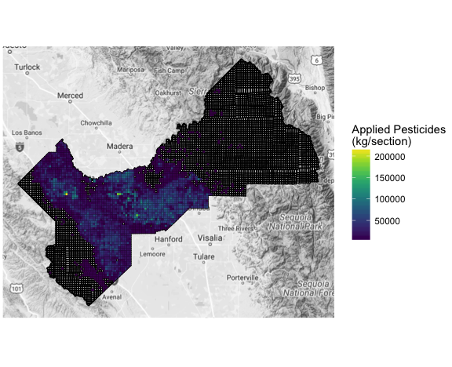

The `purexposure` package has four main categories of functions:
`find_*`, `pull_*`, `calculate_*`, and `plot_*`. `find_*` functions are
designed to explore both pesticide products and active ingredients
present in applied pesticides, return county names or codes as they are
used in PUR data sets, and find the county of a particular location.
`pull_*` functions pull raw or cleaned PUR data sets through the CA
Department of Pesticide Regulation’s FTP server. The
`calculate_exposure` function calculates exposure to applied pesticides
for a given location, and `plot_*` functions return visualizations of
application and exposure.

`purexposure` currently exists in a development version on GitHub. You
can install and load the package with the following code:

``` r
devtools::install_github("leighseverson/purexposure")
library(purexposure)
```

Many examples in this vignette also use functions from the `dplyr`
package:

``` r
library(dplyr)
```

## Overview of PUR datasets

### Units of application

Pesticide applications are reported on a product basis, but are recorded
by the California Department of Pesticide Regulation (CDPR) by active
ingredient. There are usually several active ingredients contained in a
single product, so a single pesticide product application is represented
by several rows in a data set. In PUR data sets, the `prodno` and
`chem_code`/`chemname` variables indicate product names and active
ingredient codes/names, respectively.

### Time

Records for the amount of active ingredient applied are reliably
recorded by day. Raw PUR data sets have a variable called `applic_time`,
the time that the pesticide product application was completed; however,
application time is only required for production agricultural reports
and was not added to PUR data sets until 1999. Application time is
therefore often missing in raw PUR data sets, and is not retained in
data sets cleaned using this package.

PUR data sets can be pulled by years in the range \[1990, 2015\].

### Geography

PUR data sets are organized and pulled by county. Application is
recorded by township and section, which are units of land resulting from
the Public Land Survey System (PLSS). The PLSS is used to subdivide and
describe land in the United States, and is regulated by the Bureau of
Land Management. Most midwestern, some southern, and all western states
are included in the PLSS. There are several initial points from which
PLSS surveys begin from. The line running north-south through the
initial points is called the Principle Meridian, and the east-west line
running through the points is called the base line. California contains
three of these initial points, and three Principle Meridians: Humboldt
(H), Mount Diablo (M), and San Bernardino
(S).

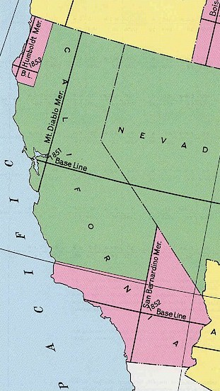

Townships are six-mile-square areas that are identified by a combination
of the location north or south of the base line, and range, the location
east or west of the principle meridian. Townships are divided into 36
one-mile-square sections. California townships are uniquely identified
by a combination of Principle Meridian (H, M, or S), location north or
south of the base line (01-48), base line direction (N or S), location
east or west of the Principle Meridian (01-47), and Principle Meridian
direction (E or W). Sections are identified by the same combination,
with the addition of the section number (01-36). For example, one
township in California is identified by “M15S24E”, and a section within
that township is identified by “M15S24E01”. The diagram below shows an
example of a township (outlined in blue) and one of the 36 sections
within that township (outlined in
red).


## Main functions in the `purexposure` package

### 1\. `find_*` functions: search for active ingredients, product names, and counties

By default, the package works with all recorded active ingredients in
the specified counties and date range. However, if you’re interested in
analyzing application of a specific active ingredient or chemical class
of active ingredients, the `find_chemical_codes` function is useful as a
starting point to see what active ingredients were present in applied
pesticides in a given year.

For example, to see how active ingredients matching “methyl bromide” or
“abietic” were recorded in the year 2000, we would
run:

``` r
find_chemical_codes(year = 2000, chemicals = c("methyl bromide", "abietic"))
#> # A tibble: 3 x 3
#>   chem_code          chemname       chemical
#>       <int>             <chr>          <chr>
#> 1       385    METHYL BROMIDE methyl bromide
#> 2      1158      ABIETIC ACID        abietic
#> 3      1212 ABIETIC ANHYDRIDE        abietic
```

The `chem_code` column gives the PUR chemical code for the active
ingredient, and `chemname` gives the PUR chemical name. `chemical` gives
the search terms input in the `chemicals` argument. This function can
also be useful to find the number of unique active ingredients that were
recorded in applied pesticides in a given year:

``` r
find_chemical_codes(2000) %>% nrow
#> [1] 3637
```

3,637 unique active ingredients were present in applied pesticides in
California in the year 2000.

The `find_chemical_codes` function works using `grep` to perform pattern
matching. Therefore, it may not be effective in returning all active
ingredients that should fall under your search term. To find an
exhaustive list of all active ingredients that fall under a chemical
class, you may find it useful to refer to the CA Department of Pesticide
Regulation (DPR)’s [Summary of Pesticide Use Report Data, Indexed by
Chemical (2008)](http://www.cdpr.ca.gov/docs/pur/pur08rep/chmrpt08.pdf).
Chemical classes available in the Summary include:

  - chemicals known to cause reproductive toxicity,
  - chemicals known to cause cancer,
  - cholinesterase-inhibiting pesticides (organophosphate and carbamate
    active ingredients),
  - pesticides on DPR’s ground water protection list,
  - pesticides on DPR’s toxic air contaminants list,
  - fumigant pesticides,
  - oil pesticides, and
  - biopesticides.

You can use active ingredients listed under the relevant class to
include in the `chemicals` argument of `find_chemical_codes` to find if
those active ingredients were present in applied pesticides in a given
year.

The `find_product_name` works similarly: you can use it to download a
product table and search for applied pesticide products for a given
year:

``` r
product_table <- find_product_name(2015, "insecticide")
```

``` r
head(product_table, 3)
#> # A tibble: 3 x 6
#>   prodno prodstat_ind                        product_name signlwrd_ind
#>    <int>        <chr>                               <chr>        <int>
#> 1     32            C                    WEST INSECTICIDE            4
#> 2     59            C              WESTBAN-2E INSECTICIDE            3
#> 3     71            C AERO WEST BRAND INSECTICIDE AEROSOL            4
#> # ... with 2 more variables: year <int>, product <chr>
```

The `prodno` column in the product table can be matched with the same
column in a PUR data set.

Counties are indicated in raw PUR data sets by `county_cd`: a two-digit
integer code (this code is unrelated to FIPS codes). While you can pull
data for for counties with either their name or PUR code, the
`find_counties` function could be useful to find the PUR code or name
associated with a county.

``` r
find_counties(c("01", "02", "03"), return = "names")
#> [1] "Alameda" "Alpine"  "Amador"
```

Additionally, the `county_codes` data set included with this package
lists all 58 counties in California with names and PUR codes as they are
recorded in PUR data sets, as well as FIPS codes, which could be useful
to link PUR data with other county-level data sets.

``` r
purexposure::county_codes %>% slice(1:3)
#> # A tibble: 3 x 3
#>   county_name pur_code fips_code
#>         <chr>    <chr>     <chr>
#> 1     ALAMEDA       01     06001
#> 2      ALPINE       02     06003
#> 3      AMADOR       03     06005
```

The `find_location_county` function takes a California address or
coordinate pair (longitude, latitude) and returns the county of that
location.

``` r
find_location_county("12906 South Fowler Ave., Selma, CA 93662")
#> [1] "Fresno"
```

This function could be useful later on if you want to pull PUR data at
the county level to calculate exposure at a particular location.

### 2\. `pull_*` functions: pull raw or cleaned PUR data sets

#### Raw data

The `pull_raw_pur` function pulls raw PUR data from CDPR’s [FTP
server](ftp://transfer.cdpr.ca.gov/pub/outgoing/pur_archives/):

``` r
fresno_raw <- pull_raw_pur(years = 2004, counties = "fresno")
```

``` r
head(fresno_raw, 2)
#> # A tibble: 2 x 33
#>    use_no prodno chem_code prodchem_pct lbs_chm_used lbs_prd_used
#>     <chr>  <chr>     <chr>        <chr>        <chr>        <chr>
#> 1 1254636  25111       253           50      0.03125       0.0625
#> 2 1254637  24089      2170         61.6    0.0866096       0.1406
#> # ... with 27 more variables: amt_prd_used <chr>, unit_of_meas <chr>,
#> #   acre_planted <chr>, unit_planted <chr>, acre_treated <chr>,
#> #   unit_treated <chr>, applic_cnt <chr>, applic_dt <chr>,
#> #   applic_time <chr>, county_cd <chr>, base_ln_mer <chr>, township <chr>,
#> #   tship_dir <chr>, range <chr>, range_dir <chr>, section <chr>,
#> #   site_loc_id <chr>, grower_id <chr>, license_no <chr>,
#> #   planting_seq <chr>, aer_gnd_ind <chr>, site_code <chr>,
#> #   qualify_cd <chr>, batch_no <chr>, document_no <chr>, summary_cd <chr>,
#> #   record_id <chr>
```

Raw data pulled using `pull_raw_pur` may differ from data sets
downloaded manually from CDPR’s FTP server in a few ways:

1.  Number of columns: The data pulled using `pull_raw_pur` always has
    33 columns. The data sets for some years and counties included
    columns called `error_flag` and `comtrs`. Since these variables are
    inconsistently present and are not documented in the User Guide &
    Documentation manual, they were removed.
2.  Order of rows: Data sets pulled using this package are arranged by
    `applic_dt` (application date) and `county_cd` (county code). This
    may not be the case for data sets downloaded manually.

For documentation of raw PUR data, you can reference the Pesticide Use
Report Data User Guide & Documentation document published by the CA
Department of Pesticide Regulation. The file is saved as “cd\_doc.pdf in
any”pur\[year\].zip" file between 1990 and 2015 found here:
<ftp://transfer.cdpr.ca.gov/pub/outgoing/pur_archives/>.

#### Cleaned data

The `pull_clean_pur` function pulls and cleans PUR data. You can
similarly pull data by years and by counties, with additional arguments
to specify the format and contents of your cleaned data set. Here’s what
a cleaned data set for Fresno county looks like for 2004:

``` r
fresno_clean <- pull_clean_pur(2004, "fresno")
```

``` r
head(fresno_clean, 2)
#> # A tibble: 2 x 13
#>   chem_code                        chemname kg_chm_used   section township
#>       <int>                           <chr>       <dbl>     <chr>    <chr>
#> 1      1855 GLYPHOSATE, ISOPROPYLAMINE SALT   0.6340852 M14S22E35  M14S22E
#> 2       806       2,4-D, DIMETHYLAMINE SALT   1.0387572 M14S22E35  M14S22E
#> # ... with 8 more variables: county_name <chr>, pur_code <chr>,
#> #   fips_code <chr>, date <date>, aerial_ground <chr>, use_no <chr>,
#> #   outlier <dbl>, prodno <int>
```

Pesticide application is recorded by active ingredient (`chem_code` and
`chemname`), kilograms of active ingredient applied (`kg_chm_used`),
section, township, county (`county_code` and `county_name`), date,
method of application (`aerial_ground`) and product number (`prodno`).
Raw PUR data sets are recorded in units of pounds, and cleaned data sets
convert applied pesticides to units of kilograms by dividing pounds of
active ingredient applied by 2.20562. The `use_no` variable uniquely
identifies pesticide product uses.

**Outliers**

The `outlier` column, in the case when the record has been flagged as an
outlier and `kg_chm_used` has been replaced with a calculated maximum
rate of application, lists the raw value of recorded kilograms of
applied chemical. This column is only included in the data frame
returned from `pull_clean_pur()` if `sum_application = FALSE`. The
algorithm used to identify and correct economically unfeasible and
therefore erroneously high records of application was developed based on
methods used by Gunier et al. (2001).

For each active ingredient and each year, a calculated maximum rate of
application was calculated as mean pounds per acre plus two standard
deviations. Rates were calculated from pounds applied by dividing the
raw `lbs_chm_used` column by either the `acre_treated` column as is for
`unit_treated == "A"` (acres), or by the `acre_treated` column
multiplied by \(\scriptsize2.29568\times10^{-5}\) for `unit_treated ==
"S"` (square feet).

If the pounds per acre applied on a particular day exceeded the
calculated maximum rate of application for the relevant year and active
ingredient, the recorded rate was replaced with the calculated maximum
rate. This calculated maximum rate of pounds per acre was then converted
back to pounds of chemical applied by multiplying the rate by the number
of acres treated, before being converted to kilograms of chemical
applied. The `outlier` column lists the raw value of kilograms of
chemical applied. If the pounds per acre applied on a particular day did
not exceed the calculated maximum rate of application for the relevant
year and active ingredient, the `outlier` column is set to `NA`.

**Table format**

By default, application records are organized by active ingredient,
section, township, date, and application method. You can change the
format of the cleaned data with additional arguments to
`pull_clean_pur`.

The `chemicals` argument uses the `find_chemical_code` function to
filter by the `chemname` column. You can filter by listing search terms
in the `chemicals`
argument:

``` r
nevada_sulfur <- pull_clean_pur(years = 2000, counties = "nevada", chemicals = "sulfur")
```

``` r
head(nevada_sulfur, 2)
#> # A tibble: 2 x 13
#>   chem_code    chemname kg_chm_used   section township county_name
#>       <int>       <chr>       <dbl>     <chr>    <chr>       <chr>
#> 1       358 LIME-SULFUR    7.468505 M15N09E15  M15N09E      NEVADA
#> 2       560      SULFUR    2.176259 M17N08E14  M17N08E      NEVADA
#> # ... with 7 more variables: pur_code <chr>, fips_code <chr>, date <date>,
#> #   aerial_ground <chr>, use_no <chr>, outlier <dbl>, prodno <int>
unique(nevada_sulfur$chemname)
#> [1] "LIME-SULFUR" "SULFUR"
```

There are several records for active ingredients matching the search
term `sulfur` for 2003 that were applied across California in 2000
(`find_chemical_codes(2000, "sulfur")`); however, only two of these were
applied in Nevada county in 2000. If you’re using the `chemicals`
argument to filter a PUR data set, you may want to do additional
filtering (for example, if you were only interested “sulfur” active
ingredients and not “lime-sulfur”).

Application method (`aerial_ground`), which indicates if pesticides were
applied aerially (`A`), by ground (`B`), or with another method (`O`),
can be retained or discarded with the `aerial_ground` argument set to
`TRUE` or `FALSE`. This choice becomes more important when summing
applied active ingredients and calculating exposure; both situations are
discussed further below.

By default, cleaned PUR data sets often have many records per day. There
are a few different options for how to sum application so that there is
one record per active ingredient or chemical class, PLS unit (section or
township), and potentially per method of application (aerial, ground, or
other). The `sum_application`, `unit`, `sum`, `aerial_ground`, and
`chemical_class` arguments are all relevant here.

When `sum_application` is set to `TRUE`, the `unit` argument indicates
what Public Land Survey (PLS) unit you would like to sum application by
(`"section"`, the default, or `"township"`). If `aerial_ground` is set
to `TRUE`, records will be summed by each method of application as well.
The `sum` argument can be set to `"all"`, the default, or
`"chemical_class"`. `"all"` indicates that you would like to sum all
active ingredients present in the data set (which could be filtered
using the `chemicals` argument) to give a daily value of kilograms of
pesticides applied per PLS unit. For example, we can pull data for 2010
in Tulare county, summed by active ingredient and township:

``` r
tulare <- pull_clean_pur(2010, "tulare", 
                         sum_application = TRUE, 
                         unit = "township", 
                         aerial_ground = FALSE)
```

``` r
tulare %>% arrange(township) %>% slice(1:3)
#> # A tibble: 3 x 7
#>     chemname kg_chm_used township county_name pur_code fips_code
#>        <chr>       <dbl>    <chr>       <chr>    <chr>     <chr>
#> 1     DIURON    97.27877  M15S25E      TULARE       54     06107
#> 2 GLYPHOSATE    47.32138  M15S25E      TULARE       54     06107
#> 3   SIMAZINE   120.15397  M15S25E      TULARE       54     06107
#> # ... with 1 more variables: date <date>
```

There is one record per active ingredient per township per day.
Alternatively, `sum = "chemical_class"` indicates that you would like to
group certain active ingredients together to give a daily value for each
chemical class that those active ingredients fall into. If `sum =
"chemical_class"`, the active ingredients that belong to each class are
specified with the `chemical_class` argument, which takes a data frame
with three columns: `chem_code`, `chem_name`, and `chemical_class`. For
example, a data frame input to the `chemical_class` argument might look
like this:

``` r
chemical_class_df <- rbind(find_chemical_codes(2000, "methylene"),
                           find_chemical_codes(2000, "aldehyde")) %>%
  rename(chemical_class = chemical) 
head(chemical_class_df, 2)
#> # A tibble: 2 x 3
#>   chem_code                             chemname chemical_class
#>       <int>                                <chr>          <chr>
#> 1      2447                CARBOXY POLYMETHYLENE      methylene
#> 2      2530 3,3-DIMETHYL-2-METHYLENE NORCAMPHENE      methylene
tail(chemical_class_df, 2)
#> # A tibble: 2 x 3
#>   chem_code                                               chemname
#>       <int>                                                  <chr>
#> 1      3758 POLYOXYETHYLENE P-TERT-BUTYL PHENOL-FORMALDEHYDE RESIN
#> 2      3405                        SODIUM FORMALDEHYDE SULFOXYLATE
#> # ... with 1 more variables: chemical_class <chr>
```

You may need to do some additional filtering if the results returned by
`find_chemical_codes` (which relies on `grep` for pattern matching) do
not give the appropriate active ingredients for your chemical class of
interest. In the case of the `chemical_class` data frame above, there
would be at most three summed values per day and per PLS unit, one for
all active ingredients falling under the class “methylene”, one for all
active ingredients falling under the class “aldehyde”, and one for
“other” with all active ingredients that don’t fit into the two
specified
classes.

``` r
fresno_classes <- pull_clean_pur(2008, "fresno", sum_application = TRUE, 
                                 unit = "section", sum = "chemical_class", 
                                 chemical_class = chemical_class_df, 
                                 aerial_ground = FALSE)
```

``` r
head(fresno_classes, 3)
#> # A tibble: 3 x 8
#>   chemical_class kg_chm_used   section township county_name pur_code
#>            <chr>       <dbl>     <chr>    <chr>       <chr>    <chr>
#> 1          other   215.69157 M12S13E27  M12S13E      FRESNO       10
#> 2          other   197.21490 M12S13E28  M12S13E      FRESNO       10
#> 3          other    15.03136 M15S23E14  M15S23E      FRESNO       10
#> # ... with 2 more variables: fips_code <chr>, date <date>
```

``` r
unique(fresno_classes$chemical_class)
#> [1] "other"     "aldehyde"  "methylene"
```

By default, `pull_clean_pur` will print a downloading progress bar for
each year of data that you are pulling. You can turn this off by setting
the `quiet` argument to `TRUE`.

If you’ve already pulled data using `pull_raw_pur`, you can clean the
data without having to pull it again by inputting the raw data frame to
the `raw_pur_df` argument. In this case, the `years` and `counties`
arguments should list years and counties present in the raw data frame.

``` r
fresno_clean <- pull_clean_pur(2004, "fresno", raw_pur_df = fresno_raw)
```

If you happen to get an error after a call to either `pull_raw_pur` or
`pull_clean_pur` (because you choose to stop the function while it’s
running, or if the FTP site is down, for example), check your working
directory. You’ll probably want to change it back from a temporary
directory.

### 3\. `calculate_exposure` to applied pesticides

The `calculate_exposure` function calculates exposure to applied
pesticides at a particular location for a given buffer extending from
the location, time period, and group of active ingredients. The required
arguments are `clean_pur_df`, a data frame returned from
`pull_clean_pur`, `location`, which can be an address or a coordinate
pair, and radius, which gives the radius of the buffer extending from
the location in meters.

Exposure is calculated by summing the amount of applied pesticides in
the fraction of sections or townships that are overlapped by the buffer
described by `radius`. For example, if a radius covers 50% of section A,
25% of section B, 25% of section C, and 30% of section D, the pesticides
applied in those section are multiplied by 0.5, 0.25, 0.25, and 0.3,
respectively. The time period over which application is summed is
determined by the `time_period` or `start_date` and `end_date`
arguments. If all three arguments are `NULL`, application is summed over
the date range of the `clean_pur_df` data set. `time_period` takes
strings of units of time (`"2 weeks"` or `"6 months"`, for example) and
calculates exposure separately using that unit of time as a break point.
The first time period will always begin on the first day of the year. If
the `clean_pur_df` data set has data from February through August, for
example, and `time_period` is set to `"6 months"`, exposure will be
calculated separately for January through June and July through
December. Alternatively, you can specify a single period of time with
`start_date` and `end_date`.

If the input `clean_pur_df` data frame has a `chemical_class` column and
the `chemicals` argument in `calculate_exposure` is set to
`"chemical_class"`, exposure will be calculated for each unique value of
the `chemical_class` column.

For example, this call calculates exposure in 2015 in a 1,500 m radius
buffer extending from Sun Empire Elementary School for all active
ingredients present in applied pesticides:

``` r
sun_empire <- pull_clean_pur(2015, "fresno") %>% 
  calculate_exposure(location = "2649 North Modoc Ave., Kerman, CA", 
                     radius = 1500) 
```

`calculate_exposure` returns a list with five elements:

``` r
names(sun_empire)
#> [1] "exposure"       "meta_data"      "buffer_plot_df" "county_plot"   
#> [5] "clean_pur_df"
```

The first is the `exposure` data frame. There will be one row per
exposure value (\(\frac{kg}{m^2}\)):

``` r
sun_empire$exposure
#> # A tibble: 1 x 9
#>      exposure chemicals start_date   end_date aerial_ground
#>         <dbl>     <chr>     <date>     <date>         <lgl>
#> 1 0.003816807       all 2015-01-01 2015-12-31            NA
#> # ... with 4 more variables: location <chr>, radius <dbl>,
#> #   longitude <dbl>, latitude <dbl>
```

The cumulative estimated exposure calculated for the year 2015 for a
1,500 m radius buffer extending from Sun Empire Elementary is about
0.0038 \(\frac{kg}{m^2}\).

The second is a `meta_data` data frame, with one row per section or
township that intersects with the specified buffer. The values in the
`meta_data` data frame can be used to re-calculate exposure. The `pls`
column will give information at the township level if the `clean_pur_df`
was summed by township; otherwise, it will give information at the
section level. The `chemicals` column specifies either “all” or a
chemical class, and `percent` gives the percent intersection of each PLS
unit with the buffer. `kg` gives the kilograms of pesticides applied in
that PLS unit for the given active ingredients and time period, and
`kg_intersection` gives the values of `kg` multiplied by `percent`, or
the amount of pesticides applied within the specified buffer.
`start_date` and `end_date` give time periods over which application was
summed. The values of `aerial_ground` will be non-missing if the
`aerial_ground` argument is set to `TRUE`. The `none_recorded` column is
`TRUE` if there were not records of application for the specified PLS
unit, active ingredients, and time period. Other columns are `location`,
`radius` and `area` (giving the area of the specified buffer in
\(m^2\)).

``` r
sun_empire$meta_data %>% slice(1:3)
#> # A tibble: 3 x 12
#>         pls chemicals    percent        kg kg_intersection start_date
#>       <chr>     <chr>      <dbl>     <dbl>           <dbl>     <date>
#> 1 M13S17E24       all 0.07462325 13065.332        974.9775 2015-01-01
#> 2 M13S17E23       all 0.52761131 11252.860       5937.1361 2015-01-01
#> 3 M13S17E22       all 0.11279351  6670.241        752.3599 2015-01-01
#> # ... with 6 more variables: end_date <date>, aerial_ground <lgl>,
#> #   none_recorded <lgl>, location <chr>, radius <dbl>, area <dbl>
```

To make the process of calculating exposure more clear, we can
re-calculate exposure by multiplying `percent` by `kg` to get
`kg_intersection` for each section, then summing across all sections and
dividing by the buffer area:

``` r
sun_empire$meta_data %>% 
  mutate(kg_intersection = percent*kg) %>% 
  group_by(chemicals, start_date, end_date, aerial_ground) %>% 
  summarise(sum = sum(kg_intersection), 
            area = first(area)) %>% 
  mutate(exposure = sum/area) %>% 
  select(exposure, 1:4)
#> # A tibble: 1 x 5
#> # Groups:   chemicals, start_date, end_date [1]
#>      exposure chemicals start_date   end_date aerial_ground
#>         <dbl>     <chr>     <date>     <date>         <lgl>
#> 1 0.003816807       all 2015-01-01 2015-12-31            NA
```

The `buffer_plot_df` element of the `calculate_exposure` list is a data
frame with spatial plotting data for the buffer and overlapping PLS
units. Using `df_plot`, we can get a rough idea of the area for which
exposure was calculated. The `plot_exposure` function, explained further
below, returns a similar plot with more
information.

``` r
df_plot(sun_empire$buffer_plot_df)
```


The `county_plot` element shows the specified buffer in the context of
the entire
county:

``` r
sun_empire$county_plot
```

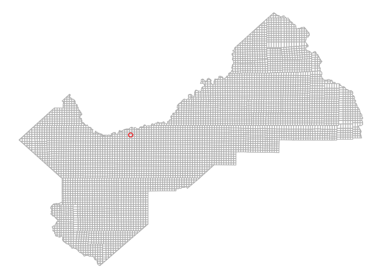

And the `clean_pur_df` element is the same data frame input to the
`clean_pur_df` argument:

``` r
sun_empire$clean_pur_df %>% head(2)
#> # A tibble: 2 x 13
#>   chem_code       chemname kg_chm_used   section township county_name
#>       <int>          <chr>       <dbl>     <chr>    <chr>       <chr>
#> 1      5014 IRON PHOSPHATE  0.57998930 M15S20E20  M15S20E      FRESNO
#> 2      3983       SPINOSAD  0.05812017 M13S22E32  M13S22E      FRESNO
#> # ... with 7 more variables: pur_code <chr>, fips_code <chr>, date <date>,
#> #   aerial_ground <chr>, use_no <chr>, outlier <dbl>, prodno <int>
```

If we wanted to calculate exposure for the same location in four month
increments, we can specify `time_period = "4 months"`.

``` r
sun_empire2 <- pull_clean_pur(2015, "fresno") %>% 
  calculate_exposure(location = "2649 North Modoc Ave., Kerman, CA", 
                     radius = 1500,
                     time_period = "4 months") 
```

``` r
sun_empire2$exposure
#> # A tibble: 3 x 9
#>       exposure chemicals start_date   end_date aerial_ground
#>          <dbl>     <chr>     <date>     <date>         <lgl>
#> 1 1.909774e-03       all 2015-01-01 2015-04-30            NA
#> 2 1.834621e-03       all 2015-05-01 2015-08-31            NA
#> 3 7.241166e-05       all 2015-09-01 2015-12-31            NA
#> # ... with 4 more variables: location <chr>, radius <dbl>,
#> #   longitude <dbl>, latitude <dbl>
```

In this case, there is one exposure value calculated for each four-month
increment in the year 2015. There can similarly be different exposure
values calculated for different values of `chemical_class` (if the
`clean_pur_df` had a `chemical_class` column and `chemicals` was set to
`"chemical_class"`) and `aerial_ground` (if the `clean_pur_df` had an
`aerial_ground` column and `aerial_ground` was set to
`TRUE`).

### 4\. `plot_*` functions: visualize application of and exposure to applied pesticides

#### Visualize exposure

The `plot_exposure` function returns a list with three elements: `maps`,
`pls_data`, and `exposure`. `pls_data` and `exposure` data frames are
similar to the `meta_dat` and `exposure` data frames returned by
`calculate_exposure`. For each exposure value that is calculated, there
is a separate map, PLS data frame (with one row per section or
township), and exposure data frame (with one row).

The first argument of plot\_exposure is a list returned by
`calculate_exposure`.

``` r
plot_sun_empire <- plot_exposure(sun_empire)
```

``` r
names(plot_sun_empire)
#> [1] "maps"     "pls_data" "exposure"
```

If we input the `sun_county` exposure list, the `pls_data` and
`exposure` data frames will be identical to the `meta_data` and
`exposure` data frames returned from `calculate_exposure`. The `maps`
element gives a plot of the location, specified buffer, and PLS units
colored according to the amount of pesticide applied.

There are a few different ways to visualize the same data on a `maps`
plot. The default of the `color_by` argument is `"amount"`, specifying a
scale legend, and that of the `buffer_or_county` argument is `"county"`,
indicating that colors should be scaled according to the range of
application for the same time period and active ingredients for the
entire
county:

``` r
plot_sun_empire$maps
```

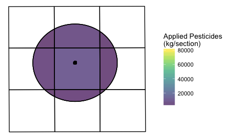

Alternatively, pesticide application can be colored according to the
percentile of county-level application it falls into (`color_by =
"percentile"`). The number of cut-points can be specified with the
`percentile` argument. The default is
`c(0.25, 0.5, 0.75)`:

``` r
plot_exposure(sun_empire, color_by = "percentile")$maps
```


If `color_by = "percentile"`, a fourth list element is returned called
`"cutoff_values"`, a data frame with two columns (`percentile` and `kg`)
that gives the cutoff value of kilograms of pesticide applied for each
percentile.

``` r
plot_se_percentile <- plot_exposure(sun_empire, color_by = "percentile")
```

``` r
plot_se_percentile$cutoff_values
#> [[1]]
#>   percentile       kg
#> 1       0.25 1352.539
#> 2       0.50 4783.970
#> 3       0.75 9963.748
```

In this case, sections with \(\leq\) 1,352.539 kilograms of pesticides
applied in the portion that intersects with the specified buffer will
fall under the lowest percentile category (“`<= 25th percentile"`).

By default, fill colors of pesticide application are scaled according to
the range of application across the entire county for the appropriate
time period and active ingredients. If you’d like fill colors of
pesticide application to be scaled according to range of application
over the PLS units plotted, you can specify `buffer_or_county` to be
`"buffer"`:

``` r
plot_exposure(sun_empire, buffer_or_county = "buffer")$maps
```

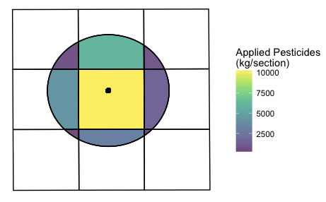

There are a few other arguments that can change the appearance of the
returned plot in other ways. `fill_option` takes any palette from the
`colormap` package. `alpha` sets the transparency of fill colors, and is
set by default to `0.7`. You can also include section or township labels
with `pls_labels` set to `TRUE`. `pls_labels_size` controls the size of
these labels (the default is `4`). For example:

``` r
plot_exposure(sun_empire, 
              fill_option = "density", 
              alpha = 0.5, 
              pls_labels = TRUE, 
              pls_labels_size = 3.5)$maps
```


The plots above visualize a single exposure value. When you specify in
your call to `calculate_exposure` that you would like to calculate
multiple exposure values for a single location (for example, in
four-month increments over 2015), the `exposure` list element has three
rows:

``` r
sun_empire2$exposure
#> # A tibble: 3 x 9
#>       exposure chemicals start_date   end_date aerial_ground
#>          <dbl>     <chr>     <date>     <date>         <lgl>
#> 1 1.909774e-03       all 2015-01-01 2015-04-30            NA
#> 2 1.834621e-03       all 2015-05-01 2015-08-31            NA
#> 3 7.241166e-05       all 2015-09-01 2015-12-31            NA
#> # ... with 4 more variables: location <chr>, radius <dbl>,
#> #   longitude <dbl>, latitude <dbl>
```

In this case, separate list elements are returned from `plot_exposure`
for each exposure value. If we input the `sun_empire2` list into
`plot_exposure`, one map, PLS data frame, and exposure row is output in
the form of a separate list element for each exposure value. `maps[[1]]`
visualizes exposure for January 1st through April 30th, `maps[[2]]` for
May 1st through August 31st, and `maps[[3]]` for September 1st through
December 31st.

(**Note:** Code for the `multiplot` function below can be found here:
<http://www.cookbook-r.com/Graphs/Multiple_graphs_on_one_page_(ggplot2)/>)

``` r
plot_sun_empire2 <- plot_exposure(sun_empire2, color_by = "percentile")
maps <- plot_sun_empire2$maps
multiplot(maps[[1]], maps[[2]], maps[[3]], cols = 2)
```

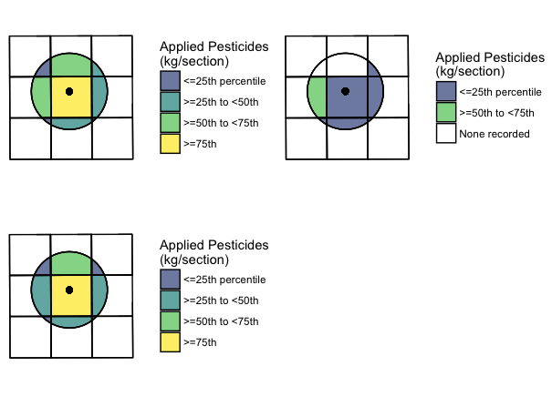

Other `plot_exposure` list elements are organized in the same way. For
example, the first `plot_sun_empire2$maps` element corresponds to
`plot_sun_empire2$pls_data[[1]]`, `plot_sun_empire2$exposure[[1]]`, and
`plot_sun_empire2$cutoff_values[[1]]`.

#### Visualize application

**Contextualize application**

The `plot_county_locations` function plots a county’s location in
California. The first argument, `counties_or_df`, can be a vector of
county names or codes or a data frame with a `county_cd`, `county_name`,
or `county_code` column (returned from `pull_raw_pur` or
`pull_clean_pur`).

``` r
plot_county_locations(fresno_clean)
```

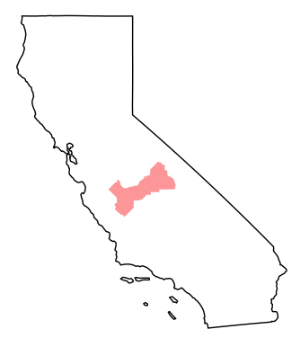

You can change the county color with `fill_color`, and change
transparency with `alpha`. If you’d like to plot multiple counties, you
can specify that they be on the same plot or on different plots with the
`seprarate_plots` argument. If `separate_plots = TRUE`,
`plot_county_locations` will return a list of plots.

**Plot application by county and PLS unit**

The `plot_county_application` function returns a list. The first element
(`map`) is a plot of application by PLS units in county. `data` is a
data frame with two columns (`pls`, giving either section or township
IDs, and `kg`, giving the plotted values of pesticides). `cutoff_values`
is a data frame with `percentile` and `kg` values, and is only returned
if application is plotted by percentile (specified with `color_by =
"percentile"`).

The first argument of `plot_county_application` should be a data frame
returned by `pull_clean_pur`.

``` r
fresno <- plot_county_application(fresno_clean)
```

``` r
names(fresno)
#> [1] "map"  "data"
```

``` r
fresno$map
```

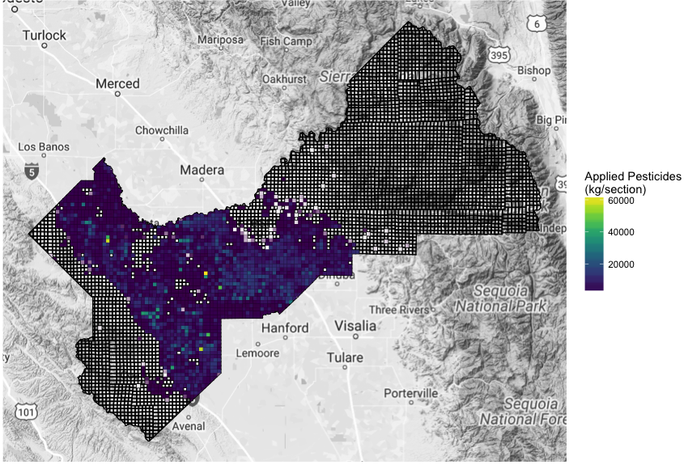

``` r
head(fresno$data, 2)
#> # A tibble: 2 x 2
#>         pls       kg
#>       <chr>    <dbl>
#> 1 M10S13E28 1583.268
#> 2 M10S13E32 1480.584
```

There are additional arguments you can pass to `plot_county_application`
to change the appearance of the returned map. You can choose to map by
township by specifying `pls = "township"`, choose to scale colors by
amount or percentile with `color_by`, specify `percentile` break points,
choose the date range that you would like to plot with `start_date` and
`end_date`, and choose certain `chemicals` to plot. You can also change
the color palette with `fill_option` (you can specify any palette from
the `colormap` package), `crop` the plot to PLS units with recorded
application, and change the transparency of colors with `alpha`.

``` r
plot_county_application(fresno_clean, pls = "township", 
                        color_by = "percentile", 
                        percentile = c(0.2, 0.4, 0.6, 0.8), 
                        fill_option = "magma", 
                        crop = TRUE)$map
```

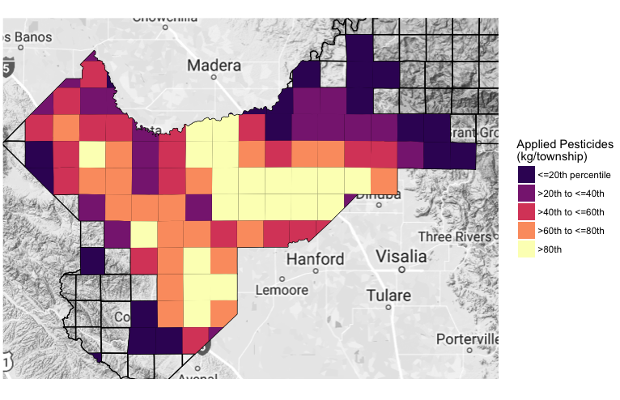

If your `clean_pur_df` data frame has data for more than one county, you
specify which `county` you would like to plot data for.

**Plot a time series of application**

The `plot_application_timeseries` function takes a data frame returned
from `pull_clean_pur` as its first argument, and returns a time series
plot of application summed by day. This plot shows total amounts of
pesticides applied per day in Fresno County in
2004:

``` r
plot_application_timeseries(fresno_clean)
```

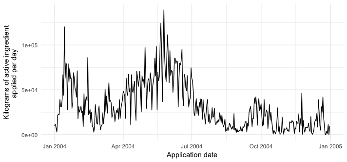

By setting `facet` to be `TRUE`, the plot will be faceted by unique
values of either `chemname` or `chemical_class`, depending on which is
present in the `clean_pur_df` data frame.

``` r
fresno_clean %>% 
  filter(chemname %in% toupper(c("sulfur", "sodium chlorate"))) %>% 
  plot_application_timeseries(facet = TRUE)
```

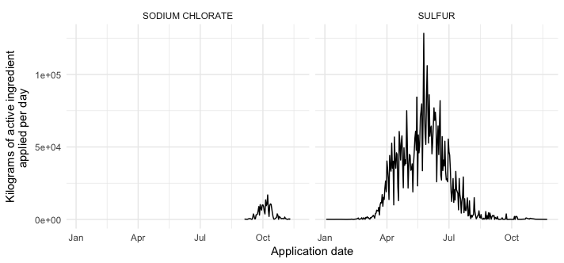

You can also change the axes scaling with `axes`, which passes its value
to the ggplot2 function `facet_wrap`.

``` r
fresno_clean %>% 
  filter(chemname %in% toupper(c("sulfur", "sodium chlorate"))) %>% 
  plot_application_timeseries(facet = TRUE, axes = "free_y")
```

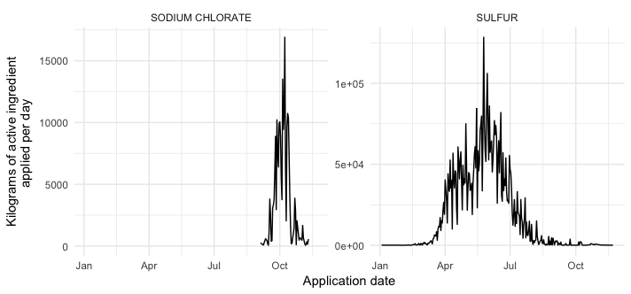

`plot_application_timeseries` returns a `ggplot2` plot, which means you
can add additional `ggplot2` arguments:

``` r
plot_application_timeseries(fresno_clean) + 
  ggplot2::theme_classic()
```


### Source code and bugs

You can browse the source code for this package here:
<https://github.com/leighseverson/purexposure>.

If you find a bug, please report it here:
<https://github.com/leighseverson/purexposure/issues>.

## References

Gunier, Robert B., Martha E. Harnly, Peggy Reynolds, Andrew Hertz, and
Julie Von Behren. 2001. “Agricultural pesticide use of California:
Pesticide prioritization, use densities, and population distributions
for a childhood cancer study.” Environmental Health Perspectives 109
(10): 1071–8. <doi:10.1289/ehp.011091071>.
